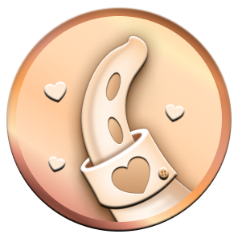
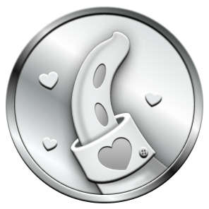
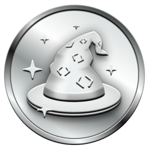
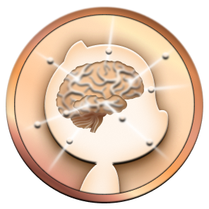
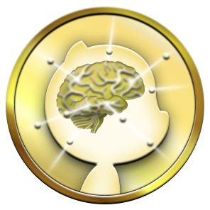
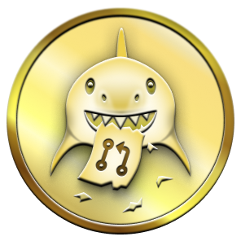
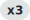

# Logros del Perfil de GitHub 🏆

Una colección completa de todos los Logros (Achievements) disponibles en el perfil de GitHub, con explicaciones detalladas en español para principiantes.

> **Nota:** Esta es una versión en español basada en el excelente trabajo de [@Schweinepriester](https://github.com/Schweinepriester/github-profile-achievements). He añadido explicaciones más detalladas y consejos prácticos para ayudar a desarrolladores que están comenzando en GitHub a entender y obtener estos logros.
> 
> **Repositorio original:** [github-profile-achievements](https://github.com/Schweinepriester/github-profile-achievements) por Schweinepriester

---

## Introducción

Tras el lanzamiento del primer helicóptero en Marte, [Ingenuity](https://es.wikipedia.org/wiki/Ingenuity), GitHub [anunció](https://github.blog/2021-04-19-open-source-goes-to-mars/) la nueva sección de Logros en los perfiles:

> Estamos aprovechando esta oportunidad para introducir una nueva sección de Logros en el perfil de GitHub. Actualmente, los Logros incluyen la insignia de la Misión del Helicóptero Mars 2020, la insignia del [Arctic Code Vault](https://archiveprogram.github.com/arctic-vault/), y una insignia por patrocinar trabajo de código abierto a través de [GitHub Sponsors](https://github.com/sponsors).

**Actualizaciones importantes:**
- **2022-06-09:** GitHub [anunció más Logros](https://github.blog/2022-06-09-introducing-achievements-recognizing-the-many-stages-of-a-developers-coding-journey/)
- **2024-02-06:** Los logros ya no están disponibles en las Discusiones de la Comunidad de GitHub para combatir el spam

**¿No te gustan los logros?** Puedes desactivarlos [aquí](https://github.com/settings/profile#profile-settings-heading).

---

## Logros

A continuación se presenta la lista completa de logros con explicaciones detalladas para ayudarte a entender qué significa cada uno y cómo obtenerlos.

| Título | Insignia | ¿Se puede obtener? | Cómo obtenerlo |
| --- | --- | --- | --- |
Heart On Your Sleeve |  | ❌ (🔜 En pruebas) | Reaccionar a algo en GitHub con el emoji ❤️
Open Sourcerer |  | ❌ (🔜 En pruebas) | El usuario tuvo PRs fusionados en múltiples repositorios públicos
||| <!-- esta fila vacía es intencional para separar -->
Pair Extraordinaire |  | ✔️ | Ser [coautor](https://docs.github.com/es/pull-requests/committing-changes-to-your-project/creating-and-editing-commits/creating-a-commit-with-multiple-authors) en un pull request fusionado
Quickdraw |  | ✔️ | Cerrar un issue o pull request dentro de 5 minutos de haberlo abierto
Starstruck |  | ✔️ | Crear un repositorio que tenga 16 estrellas
||| <!-- esta fila vacía es intencional para separar -->
Galaxy Brain |  | ✔️ | 2 respuestas aceptadas
Pull Shark |  | ✔️ | 2 pull requests fusionados
YOLO |  | ✔️ | Fusionar tu propio pull request sin revisión de código
||| <!-- esta fila vacía es intencional para separar -->
Arctic Code Vault Contributor |  | ❌ | Contribuir código a repositorios en el [Programa de Archivo de GitHub 2020](https://archiveprogram.github.com/)
Public Sponsor |  | ✔️ | Patrocinar trabajo open source vía [GitHub Sponsors](https://github.com/sponsors)
Mars 2020 Contributor |  | ❌ | Contribuir código a repositorios usados en la [Misión del Helicóptero Mars 2020](https://github.com/readme/nasa-ingenuity-helicopter)

---

## Explicaciones Detalladas para Principiantes

### 🧪 Logros en Fase de Prueba

#### Heart On Your Sleeve (Corazón en la Manga)
**¿Qué significa?** Este logro reconoce a usuarios que expresan aprecio y emoción en GitHub.

**Cómo obtenerlo:** Reacciona a contenido en GitHub usando el emoji ❤️ (corazón).

**Detalles adicionales:**
- Demuestra que eres un miembro activo y expresivo de la comunidad
- Ayuda a crear un ambiente positivo en los proyectos
- Tiene múltiples niveles según la cantidad de reacciones que des

---

#### Open Sourcerer (Hechicero del Código Abierto)
**¿Qué significa?** Reconoce a desarrolladores que contribuyen activamente a múltiples proyectos de código abierto.

**Cómo obtenerlo:** Tener Pull Requests (PRs) fusionados en múltiples repositorios públicos.

**Detalles adicionales:**
- Demuestra versatilidad y compromiso con el código abierto
- No basta con contribuir a un solo proyecto, debes diversificar
- Es uno de los logros más prestigiosos por su dificultad

---

### ✅ Logros Disponibles

#### Pair Extraordinaire (Pareja Extraordinaria)
**¿Qué significa?** Celebra el trabajo en equipo y la colaboración en el desarrollo de software.

**Cómo obtenerlo:** Ser [coautor](https://docs.github.com/es/pull-requests/committing-changes-to-your-project/creating-and-editing-commits/creating-a-commit-with-multiple-authors) en un Pull Request que se fusione.

**Detalles adicionales:**
- Fomenta la programación en pareja (pair programming)
- Para ser coautor, otro desarrollador debe incluirte en el commit con:
  ```
  Co-authored-by: nombre <email@ejemplo.com>
  ```
- Excelente para equipos que practican revisión de código colaborativa
- Tiene niveles: Bronze (10 PRs), Silver (24 PRs), Gold (48 PRs)

**Consejo:** Trabaja en proyectos colaborativos y asegúrate de que tus compañeros te acrediten como coautor.

---

#### Quickdraw (Pistolero Rápido)
**¿Qué significa?** Reconoce la rapidez y eficiencia en resolver problemas.

**Cómo obtenerlo:** Cerrar un issue o Pull Request dentro de los 5 minutos posteriores a su apertura.

**Detalles adicionales:**
- Demuestra que eres rápido identificando y solucionando problemas
- Útil para issues duplicados o PRs que necesitan corrección inmediata
- Puede obtenerse cerrando tu propio issue/PR o el de otros (si tienes permisos)
- No tiene niveles adicionales

**Consejo:** Mantente atento a las notificaciones de tu repositorio para responder rápidamente.

---

#### Starstruck (Deslumbrado por las Estrellas)
**¿Qué significa?** Celebra la creación de proyectos populares que la comunidad valora.

**Cómo obtenerlo:** Crear un repositorio que alcance 16 estrellas.

**Detalles adicionales:**
- Las estrellas deben ser en UN SOLO repositorio, no acumulativas
- Demuestra que has creado algo útil o interesante para la comunidad
- Tiene múltiples niveles:
  - **Base:** 16 estrellas
  - **Bronze 🥉:** 128 estrellas
  - **Silver 🥈:** 512 estrellas
  - **Gold 🥇:** 4,096 estrellas

**Consejo:** Crea proyectos útiles, documéntalos bien y compártelos en redes sociales y comunidades relevantes.

---

#### Galaxy Brain (Cerebro Galáctico)
**¿Qué significa?** Reconoce a expertos que ayudan a otros resolviendo sus dudas.

**Cómo obtenerlo:** Tener 2 respuestas aceptadas en GitHub Discussions.

**Detalles adicionales:**
- Las respuestas deben ser marcadas como "aceptadas" por quien hizo la pregunta
- Funciona en GitHub Discussions (no en Issues)
- Demuestra conocimiento técnico y habilidad para comunicar soluciones
- Niveles disponibles:
  - **Base:** 2 respuestas aceptadas
  - **Bronze 🥉:** 8 respuestas aceptadas
  - **Silver 🥈:** 16 respuestas aceptadas
  - **Gold 🥇:** 32 respuestas aceptadas

**Consejo:** Participa activamente en las Discussions de proyectos que conoces bien.

---

#### Pull Shark (Tiburón de Pull Requests)
**¿Qué significa?** Reconoce la contribución constante mediante Pull Requests.

**Cómo obtenerlo:** Tener 2 Pull Requests fusionados.

**Detalles adicionales:**
- Los PRs pueden ser en cualquier repositorio (propios o de terceros)
- Deben ser fusionados (merged), no solo abiertos
- Uno de los logros más comunes entre desarrolladores activos
- Niveles disponibles:
  - **Base:** 2 PRs fusionados
  - **Bronze 🥉:** 16 PRs fusionados
  - **Silver 🥈:** 128 PRs fusionados
  - **Gold 🥇:** 1,024 PRs fusionados

**Consejo:** Contribuye regularmente a proyectos open source o trabaja en equipo en repositorios compartidos.

---

#### YOLO (You Only Live Once - Solo Se Vive Una Vez)
**¿Qué significa?** Un logro humorístico que reconoce la confianza (¿o temeridad?) de fusionar código sin revisión.

**Cómo obtenerlo:** Fusionar tu propio Pull Request sin revisión de código (code review).

**Detalles adicionales:**
- Debes tener permisos para fusionar PRs en el repositorio
- El PR debe ser tuyo (tú lo creaste)
- No debe tener ninguna revisión aprobada de otros usuarios
- Es un logro controvertido: algunos lo ven como valentía, otros como mala práctica
- No tiene niveles adicionales

**Nota importante:** Aunque es divertido obtener este logro, en proyectos serios siempre es recomendable tener revisiones de código.

---

#### Arctic Code Vault Contributor (Contribuidor de la Bóveda de Código Ártico)
**¿Qué significa?** Tu código fue preservado en el Ártico para las futuras generaciones.

**Cómo se obtuvo:** Contribuir código a repositorios incluidos en el [Programa de Archivo de GitHub 2020](https://archiveprogram.github.com/).

**Estado:** ❌ No disponible (evento único)

**Detalles adicionales:**
- GitHub archivó código open source en una bóveda en Svalbard, Noruega
- El código se almacenó en película especial diseñada para durar 1,000 años
- Solo los contribuidores activos antes de febrero de 2020 lo obtuvieron
- Es un logro de colección histórica

---

#### Public Sponsor (Patrocinador Público)
**¿Qué significa?** Apoyas financieramente el desarrollo de código abierto.

**Cómo obtenerlo:** Patrocinar trabajo open source a través de [GitHub Sponsors](https://github.com/sponsors).

**Detalles adicionales:**
- Debes patrocinar a al menos un desarrollador o proyecto
- El patrocinio debe ser público (no anónimo)
- Puedes patrocinar desde $1 USD al mes
- Demuestra compromiso con la sostenibilidad del código abierto
- No tiene niveles adicionales

**Consejo:** Apoya a los mantenedores de herramientas que usas regularmente.

---

#### Mars 2020 Contributor (Contribuidor de Mars 2020)
**¿Qué significa?** Tu código voló a Marte en el helicóptero Ingenuity.

**Cómo se obtuvo:** Contribuir código a repositorios utilizados en la [Misión del Helicóptero Mars 2020](https://github.com/readme/nasa-ingenuity-helicopter).

**Estado:** ❌ No disponible (evento único)

**Detalles adicionales:**
- Uno de los logros más prestigiosos y raros
- Solo se otorgó a contribuidores de librerías específicas usadas por la NASA
- Incluye proyectos como Python, Linux kernel, y otras dependencias críticas
- Es literalmente tener tu código en otro planeta

---

## Niveles

Algunos logros no solo tienen la versión base, sino también niveles superiores.

| Título | Nivel | Insignia | Cómo obtenerlo |
| --- | --- | --- | --- |
Heart On Your Sleeve x2 | Bronze 🥉 |  | 16 reacciones ❤️
Heart On Your Sleeve x3 | Silver 🥈 |  | 128 reacciones ❤️
Heart On Your Sleeve x4 | Gold 🥇 |  | ??? reacciones ❤️
Open Sourcerer x2 | Bronze 🥉 |  | 8 pull requests open source fusionados
Open Sourcerer x3 | Silver 🥈 |  | 16 pull requests open source fusionados
Open Sourcerer x4 | Gold 🥇 |  | 64 pull requests open source fusionados
||| <!-- esta fila vacía es intencional para separar -->
Pair Extraordinaire x2 | Bronze 🥉 |  | Coautor en 10 pull requests fusionados
Pair Extraordinaire x3 | Silver 🥈 |  | Coautor en 24 pull requests fusionados
Pair Extraordinaire x4 | Gold 🥇 |  | Coautor en 48 pull requests fusionados
Starstruck x2 | Bronze 🥉 |  | Crear un repositorio que tenga 128 estrellas
Starstruck x3 | Silver 🥈 |  | Crear un repositorio que tenga 512 estrellas
Starstruck x4 | Gold 🥇 |  | Crear un repositorio que tenga 4096 estrellas
||| <!-- esta fila vacía es intencional para separar -->
Galaxy Brain x2 | Bronze 🥉 |  | 8 respuestas aceptadas
Galaxy Brain x3 | Silver 🥈 |  | 16 respuestas aceptadas
Galaxy Brain x4 | Gold 🥇 |  | 32 respuestas aceptadas
Pull Shark x2 | Bronze 🥉 |  | 16 pull requests fusionados
Pull Shark x3 | Silver 🥈 |  | 128 pull requests fusionados
Pull Shark x4 | Gold 🥇 |  | 1024 pull requests fusionados

## Lista oficial

~~Existe~~ Existía una lista oficial disponible en la documentación de GitHub en  
<https://docs.github.com/es/account-and-profile/setting-up-and-managing-your-github-profile/customizing-your-profile/personalizing-your-profile#displaying-badges-on-your-profile> ([enlace a la versión archivada](https://web.archive.org/web/20220531023858/https://docs.github.com/en/account-and-profile/setting-up-and-managing-your-github-profile/customizing-your-profile/personalizing-your-profile#displaying-badges-on-your-profile)).  
Todavía hay una sección que incluye detalles específicos sobre cómo se otorgaron/otorgan las insignias, por ejemplo, qué [repositorios y versiones calificaron para el Mars 2020 Helicopter Contributor](https://docs.github.com/en/account-and-profile/setting-up-and-managing-your-github-profile/customizing-your-profile/personalizing-your-profile#list-of-qualifying-repositories-for-mars-2020-helicopter-contributor-achievement).

~~Considera este repositorio como un espejo, quizás en el futuro con propósito histórico.~~ A menos que haya una lista oficial nuevamente, esta es la referencia.

## Detalles

### Cómo lograr cada uno

Por ahora, consulta las [discusiones](https://github.com/Schweinepriester/github-profile-achievements/discussions) (en inglés).  
Según nuestro conocimiento:

- [Galaxy Brain](https://github.com/Schweinepriester/github-profile-achievements/discussions/9#discussioncomment-2927413)
- [YOLO](https://github.com/Schweinepriester/github-profile-achievements/discussions/6#discussioncomment-2934257)

### Etiquetas de niveles

Cada nivel tiene una etiqueta asociada que incluye un color.

| Nivel | Etiqueta | Muestra | Hex | Visual |
| --- | --- | --- | --- | --- |
Bronze 🥉 | x2 |  | #F9BFA7 | 
Silver 🥈 | x3 |  | #E1E4E4 | 
Gold 🥇 | x4 |  | #FAE57E | 

### Muestras al 100%

[Aquí](images/captured/complete) hay capturas de pantalla de todos los Logros desbloqueados al 100% como se ven en el diálogo completo, tanto en modo claro como oscuro.  
Vélos en vivo, incluyendo la animación que algunos tienen, por ejemplo aquí:

| Título | Muestra |
| --- | --- |
Pair Extraordinaire | [Muestra en vivo 100% desbloqueado por @Rongronggg9](https://github.com/Rongronggg9?achievement=pair-extraordinaire&tab=achievements)
Quickdraw | [Muestra en vivo 100% desbloqueado por @Schweinepriester](https://github.com/Schweinepriester?achievement=quickdraw&tab=achievements)
Starstruck | [Muestra en vivo 100% desbloqueado por @torvalds](https://github.com/torvalds?achievement=starstruck&tab=achievements)
||| <!-- esta fila vacía es intencional para separar -->
Galaxy Brain | [Muestra en vivo 100% desbloqueado por @ljharb](https://github.com/ljharb?achievement=galaxy-brain&tab=achievements)
Pull Shark | [Muestra en vivo 100% desbloqueado por @ljharb](https://github.com/ljharb?achievement=pull-shark&tab=achievements)
YOLO | [Muestra en vivo 100% desbloqueado por @Schweinepriester](https://github.com/Schweinepriester?achievement=yolo&tab=achievements)
||| <!-- esta fila vacía es intencional para separar -->
Arctic Code Vault Contributor | [Muestra en vivo 100% desbloqueado por @Schweinepriester](https://github.com/Schweinepriester?tab=achievements&achievement=arctic-code-vault-contributor)
Public Sponsor | [Muestra en vivo 100% desbloqueado por @ljharb](https://github.com/ljharb?tab=achievements&achievement=public-sponsor)
Mars 2020 Contributor | [Muestra en vivo 100% desbloqueado por @torvalds](https://github.com/torvalds?achievement=mars-2020-contributor&tab=achievements)

¿Conoces a un usuario con todos los Logros con el nivel más alto al mismo tiempo? ¡Házmelo saber [aquí](https://github.com/Schweinepriester/github-profile-achievements/discussions/925)!

### Variantes

[Aquí](images/variants) están las variantes de las Insignias incluyendo el [Octocat :octocat:](https://github.com/logos) basado en [la configuración](https://github.com/settings/appearance#emoji-heading) para el [tono de piel de Emoji](https://es.wikipedia.org/wiki/Emoji#Modificadores_de_tono_de_piel) [✌️](https://emojipedia.org/victory-hand/)[✌🏻✌🏼✌🏽✌🏾✌🏿](https://emojipedia.org/emoji-modifier-sequence/)..

## Destacados

La sección de Destacados (Highlights) debajo de los Logros, incluyendo las insignias correspondientes, está actualmente [mejor documentada en la documentación oficial de GitHub](https://docs.github.com/es/account-and-profile/setting-up-and-managing-your-github-profile/customizing-your-profile/personalizing-your-profile#displaying-badges-on-your-profile).

## Versiones anteriores

### 2021-04-19 - 2022-06-09

Desde el [inicio con Ingenuity el 2021-04-19](https://github.blog/2021-04-19-open-source-goes-to-mars/) hasta las [adiciones del 2022-06-09](https://github.blog/2022-06-09-introducing-achievements-recognizing-the-many-stages-of-a-developers-coding-journey/), los primeros tres Logros tenían diseños y nombres ligeramente diferentes. En otras palabras, fueron renovados el 2022-06-09.

```diff
- GitHub Sponsor
+ Public Sponsor
- Mars 2020 Helicopter Contributor
+ Mars 2020 Contributor
```

Aquí están los diseños y nombres antiguos:

| Título | Insignia |
| --- | --- |
Arctic Code Vault Contributor | 
GitHub Sponsor | 
Mars 2020 Helicopter Contributor | 

## Ver también

* [Flet/rejected-github-profile-achievements](https://github.com/Flet/rejected-github-profile-achievements) para reírse un poco sobre los Logros
* [drknzz/GitHub-Achievements](https://github.com/drknzz/GitHub-Achievements) igual que esta colección, ¡pero diferente! ;)

---

## Cómo Obtener Cada Logro

### Guía Paso a Paso

#### 🎯 Para Principiantes

Si eres nuevo en GitHub, estos son los logros más fáciles de conseguir:

1. **Pull Shark (Base):** 
   - Crea un repositorio de prueba
   - Haz un fork o crea una rama
   - Crea un PR y fusiónalo
   - Repite una vez más

2. **YOLO:**
   - En tu propio repositorio, crea un PR
   - Fusiónalo inmediatamente sin esperar revisión
   - ¡Logro desbloqueado!

3. **Public Sponsor:**
   - Ve a [GitHub Sponsors](https://github.com/sponsors)
   - Elige un proyecto o desarrollador para apoyar
   - Patrocina con cualquier cantidad (desde $1)

#### 🚀 Para Usuarios Intermedios

1. **Starstruck:**
   - Crea un proyecto útil o interesante
   - Documéntalo bien con un README atractivo
   - Compártelo en Reddit, Twitter, Dev.to, etc.
   - Pide feedback en comunidades relevantes

2. **Pair Extraordinaire:**
   - Trabaja en proyectos colaborativos
   - Cuando hagas pair programming, usa co-authored-by
   - Revisa código de otros y ofrece ayuda

3. **Galaxy Brain:**
   - Busca proyectos con GitHub Discussions activas
   - Responde preguntas en áreas donde tengas experiencia
   - Proporciona respuestas detalladas y útiles

#### 💪 Para Usuarios Avanzados

1. **Pull Shark (Niveles Altos):**
   - Contribuye regularmente a proyectos open source
   - Participa en Hacktoberfest
   - Mantén tus propios proyectos activos

2. **Open Sourcerer:**
   - Diversifica tus contribuciones
   - Contribuye a diferentes proyectos
   - Busca "good first issue" en proyectos populares

---

## Preguntas Frecuentes

### ¿Cómo veo mis logros?

Visita tu perfil de GitHub: `https://github.com/tu-usuario?tab=achievements`

### ¿Puedo ocultar mis logros?

Sí, ve a [Configuración de Perfil](https://github.com/settings/profile#profile-settings-heading) y desactiva "Mostrar Logros en mi perfil".

### ¿Los logros afectan mi perfil profesional?

Los logros son principalmente para diversión y gamificación. Algunos reclutadores los consideran, pero tu código y contribuciones reales son mucho más importantes.

### ¿Puedo perder un logro?

No, una vez obtenido, el logro permanece en tu perfil permanentemente.

### ¿Los logros privados cuentan?

Depende del logro:
- **Pull Shark:** Solo PRs en repositorios públicos
- **Starstruck:** Solo repositorios públicos
- **Galaxy Brain:** Solo Discussions públicas
- **Public Sponsor:** Debe ser patrocinio público

### ¿Cuál es el logro más difícil?

**Open Sourcerer Gold** (64 PRs en múltiples repos públicos) y **Starstruck Gold** (4,096 estrellas) son probablemente los más difíciles.

### ¿Hay logros secretos?

No oficialmente, pero GitHub ocasionalmente añade nuevos logros sin anunciarlos inmediatamente.

---

## Ejemplos en Vivo

Aquí puedes ver ejemplos de usuarios con logros al 100%:

| Logro | Usuario de Ejemplo |
| --- | --- |
| Pair Extraordinaire | [@Rongronggg9](https://github.com/Rongronggg9?achievement=pair-extraordinaire&tab=achievements) |
| Quickdraw | [@Schweinepriester](https://github.com/Schweinepriester?achievement=quickdraw&tab=achievements) |
| Starstruck | [@torvalds](https://github.com/torvalds?achievement=starstruck&tab=achievements) |
| Galaxy Brain | [@ljharb](https://github.com/ljharb?achievement=galaxy-brain&tab=achievements) |
| Pull Shark | [@ljharb](https://github.com/ljharb?achievement=pull-shark&tab=achievements) |
| YOLO | [@Schweinepriester](https://github.com/Schweinepriester?achievement=yolo&tab=achievements) |

---

## Recursos Adicionales

- [Documentación Oficial de GitHub](https://docs.github.com/es/account-and-profile/setting-up-and-managing-your-github-profile/customizing-your-profile/personalizing-your-profile)
- [Repositorio Original (Inglés)](https://github.com/Schweinepriester/github-profile-achievements)
- [GitHub Blog - Anuncio de Logros](https://github.blog/2022-06-09-introducing-achievements-recognizing-the-many-stages-of-a-developers-coding-journey/)

---

## Contribuir

¿Encontraste información incorrecta o desactualizada? ¿Tienes consejos adicionales? ¡Las contribuciones son bienvenidas!

---

## Licencia

Este proyecto es un remix educativo. Consulta el archivo [LICENSE](LICENSE) para más detalles.

---

**Nota:** Este es un proyecto no oficial. GitHub puede cambiar los criterios de los logros en cualquier momento.

¡Buena suerte coleccionando tus logros! 🎮✨
